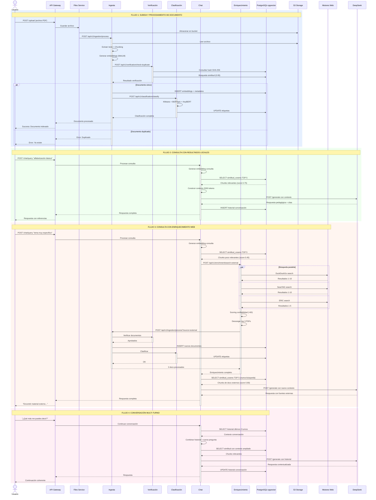
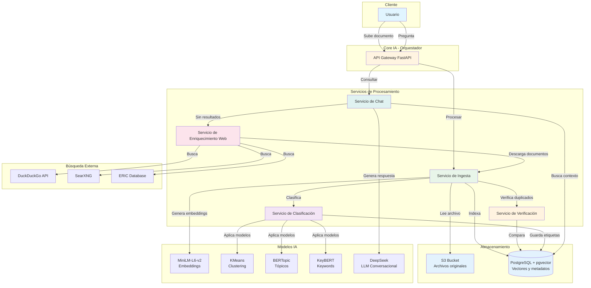
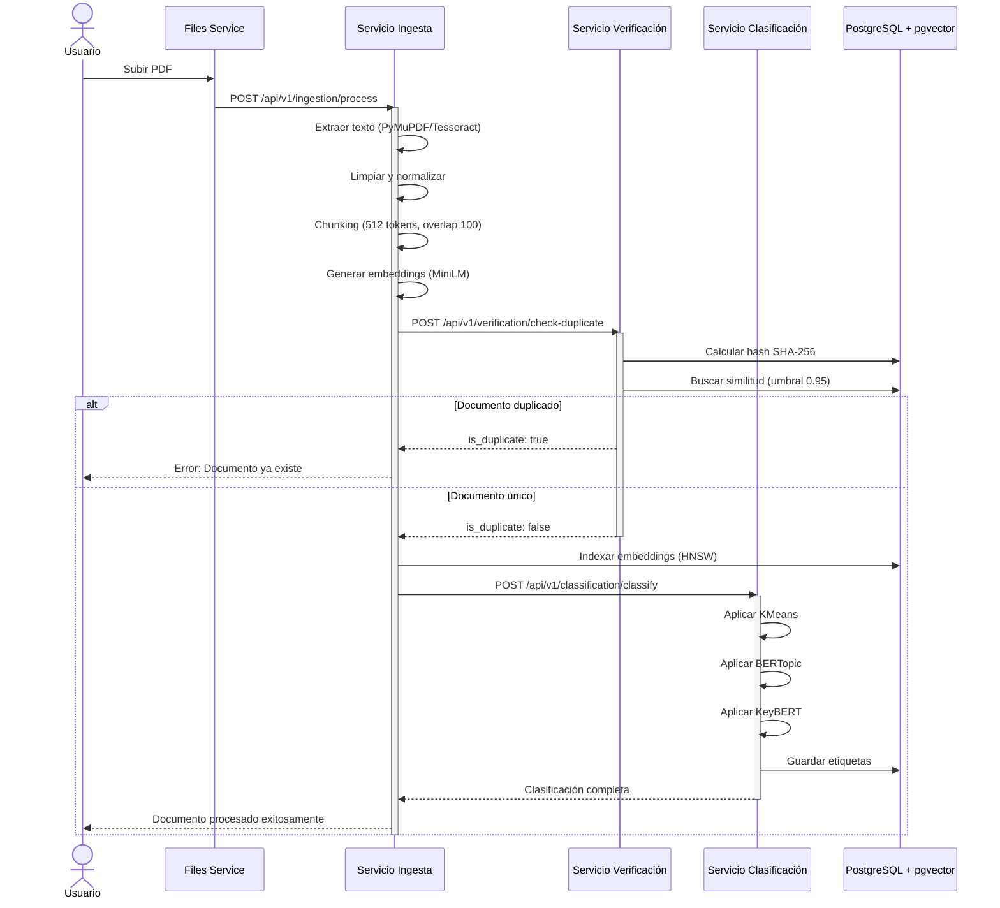
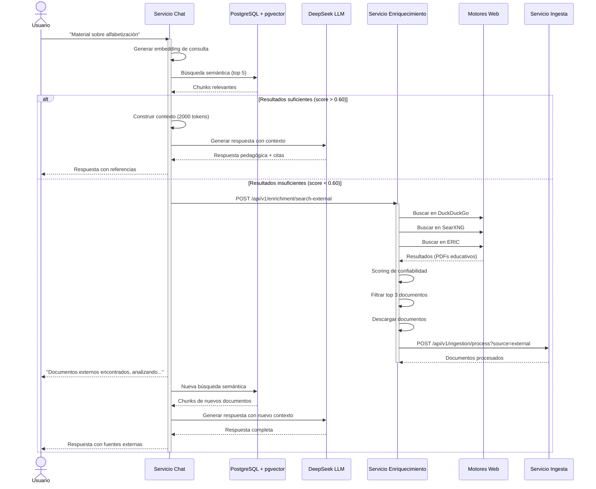
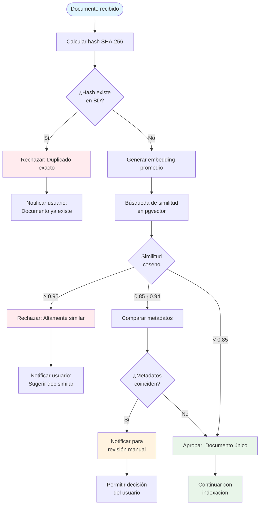
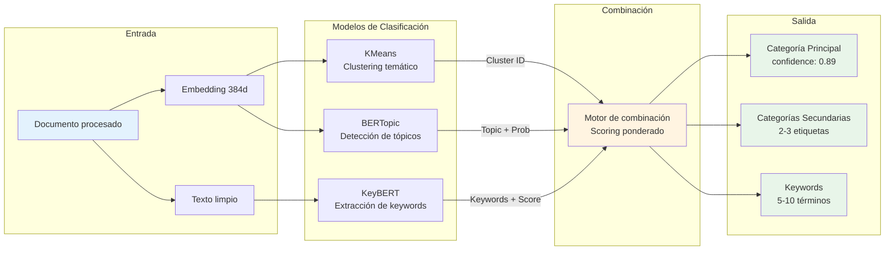
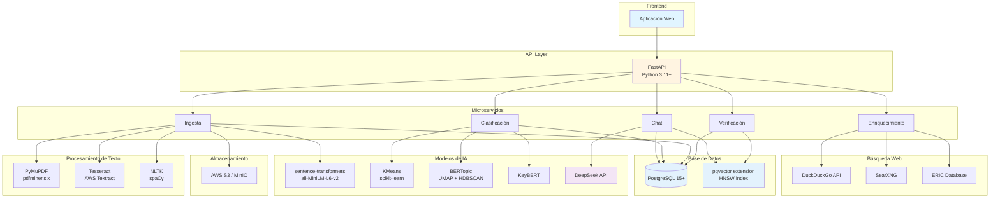

# Núcleo de Aplicación: Core IA

## Descripción general

El Core IA es el núcleo inteligente de la plataforma educativa. Su principal responsabilidad es gestionar el ciclo de vida de los documentos educativos y permitir la interacción conversacional entre los usuarios y el conocimiento almacenado en la base vectorial.

Funciona como un servicio orquestador basado en APIs RESTful síncronas, compuesto por cinco microservicios especializados de IA que cooperan entre sí:

1. Servicio de Ingesta de Documentos
2. Servicio de Verificación y Deduplicación
3. Servicio de Clasificación / Etiquetado
4. Servicio de Búsqueda Semántica y Chat Asistente
5. Servicio de Enriquecimiento Web (Agente de exploración)

---

## Componentes principales del Core IA

### 1. Servicio de Ingesta de Documentos

#### Responsabilidad
Procesar automáticamente los documentos (PDF u otros formatos) que los usuarios suben a la plataforma y prepararlos para su análisis, clasificación e indexación vectorial.

#### Flujo de trabajo

**1.1 Recepción del documento**
- El archivo llega desde el servicio de Files (almacenado en S3 u otro bucket)
- Se dispara automáticamente un proceso de ingesta mediante llamada API síncrona
- Endpoint: `POST /api/v1/ingestion/process`

**1.2 Extracción de texto**
- Si el PDF contiene texto: se utiliza PyMuPDF o pdfminer.six
- Si es una imagen o escaneo: se aplica OCR con Tesseract o AWS Textract

**1.3 Limpieza y normalización**
- Eliminación de caracteres especiales, encabezados repetitivos, saltos de línea innecesarios
- Uso de `re`, `nltk` o `spaCy` para tokenización y lematización
- Normalización de encoding a UTF-8

**1.4 Estrategia de Chunking**
- División inteligente del texto en fragmentos (chunks) de 512 tokens
- Overlap de 100 tokens entre chunks consecutivos para mantener contexto semántico
- Preservación de párrafos completos cuando sea posible para evitar cortes abruptos

**1.5 Generación de embeddings**
- Se generan representaciones vectoriales mediante el modelo sentence-transformers/all-MiniLM-L6-v2
- Modelo liviano y eficiente (384 dimensiones) entrenado para similitud semántica
- Cada chunk genera un vector de 384 dimensiones

**1.6 Comunicación con Verificación**
- Antes de indexar, se llama al servicio de Verificación mediante API síncrona
- Endpoint: `POST /api/v1/verification/check-duplicate`
- Payload: `{ "embedding": [...], "metadata": {...} }`
- Si el documento es duplicado, se detiene el proceso y se notifica al usuario
- Si es único, continúa con la indexación

**1.7 Indexación**
- Los vectores se almacenan en pgvector (extensión de PostgreSQL para datos vectoriales)
- Se utiliza índice HNSW (Hierarchical Navigable Small World) para búsquedas eficientes en grandes volúmenes
- Se guarda también el metadato: nombre, autor, tema estimado, fecha de ingesta, hash del documento, ubicación del archivo

**1.8 Comunicación con Clasificación**
- El servicio envía al clasificador los embeddings y metadatos mediante API síncrona
- Endpoint: `POST /api/v1/classification/classify`

#### Herramientas clave
`PyMuPDF`, `pdfminer.six`, `Tesseract`, `AWS Textract`, `re`, `nltk`, `spaCy`, `pgvector`, `sentence-transformers`, `FastAPI`

---

### 2. Servicio de Verificación y Deduplicación

#### Responsabilidad
Evitar la ingesta de documentos duplicados o altamente similares, optimizando el uso de almacenamiento y garantizando la calidad de la base de conocimiento.

#### Proceso de verificación

**2.1 Recepción del embedding**
- El servicio recibe el embedding del documento candidato desde el Servicio de Ingesta
- Endpoint: `POST /api/v1/verification/check-duplicate`

**2.2 Cálculo de hash del documento**
- Se genera un hash SHA-256 del contenido completo del documento
- Verificación rápida en base de datos: si el hash existe, es un duplicado exacto
- Respuesta inmediata sin necesidad de comparación semántica

**2.3 Búsqueda de similitud semántica**
- Si no hay coincidencia exacta por hash, se realiza búsqueda por similitud coseno
- Se consulta pgvector con los embeddings existentes
- Umbral de similitud: 0.95 (documentos con similitud mayor o igual a 95% se consideran duplicados)

**2.4 Análisis de metadatos**
- Comparación adicional de:
  - Título del documento (similitud de strings con Levenshtein)
  - Autor
  - Fecha de publicación
  - Número de páginas
- Si hay coincidencia alta en metadatos + similitud mayor a 0.90, se marca como posible duplicado

**2.5 Respuesta al servicio de Ingesta**
```json
{
  "is_duplicate": true/false,
  "similarity_score": 0.97,
  "matching_documents": [
    {
      "id": "doc_123",
      "title": "Documento similar existente",
      "similarity": 0.97
    }
  ],
  "action": "reject" | "accept" | "merge"
}
```

**2.6 Acciones según resultado**
- Duplicado exacto (hash match): Rechazar y notificar al usuario
- Alta similitud (mayor a 0.95): Rechazar y sugerir documento existente
- Similitud moderada (0.85-0.95): Notificar al usuario y permitir decisión manual
- Único (menor a 0.85): Aprobar para indexación

#### Base de datos de verificación
- Tabla `document_hashes`: almacena hashes SHA-256 de todos los documentos
- Tabla `document_signatures`: almacena embeddings promedio por documento para comparación rápida
- Índice en pgvector para búsquedas vectoriales eficientes

#### Herramientas clave
`hashlib`, `pgvector`, `scikit-learn`, `Levenshtein`, `FastAPI`

---

### 3. Servicio de Clasificación / Etiquetado

#### Responsabilidad
Determinar automáticamente el tema o categoría del documento para organizarlo dentro de la plataforma.

#### Procesos

**3.1 Entrada**
- Recibe embeddings o texto preprocesado desde el servicio de Ingesta
- Endpoint: `POST /api/v1/classification/classify`

**3.2 Modelos aplicables**

**KMeans - Clustering temático no supervisado**
- Agrupa documentos en clusters predefinidos
- Útil para identificar patrones temáticos generales
- Se entrena periódicamente con el corpus completo

**BERTopic - Clasificación semántica basada en embeddings**
- Reducción de dimensionalidad con UMAP
- Clustering con HDBSCAN
- Genera tópicos descriptivos automáticamente
- Se actualiza mensualmente con nuevos documentos

**KeyBERT - Extracción de palabras clave representativas**
- Identifica los conceptos más importantes del documento
- Genera entre 5-10 keywords por documento
- Se usa para etiquetado granular y búsquedas complementarias

**3.3 Estrategia de clasificación híbrida**
```python
# Pseudocódigo del proceso
def classify_document(embedding, text):
    # Clasificación por cluster
    cluster = kmeans.predict(embedding)
    
    # Extracción de tópico
    topic = bertopic.transform(embedding)
    
    # Extracción de keywords
    keywords = keybert.extract_keywords(text, top_n=8)
    
    # Clasificación final combinada
    labels = combine_classifications(cluster, topic, keywords)
    
    return {
        "primary_category": labels[0],
        "secondary_categories": labels[1:3],
        "keywords": keywords,
        "confidence": confidence_score
    }
```

**3.4 Asignación de etiquetas**
- Se determina una categoría principal y hasta 2 categorías secundarias
- Categorías ejemplo: "Matemáticas", "Pedagogía", "Lenguaje", "Alfabetización", "Didáctica", "Evaluación"
- Las etiquetas se almacenan junto al vector en la base de datos
- Cada etiqueta incluye un score de confianza (0-1)

**3.5 Salida**
```json
{
  "document_id": "doc_456",
  "primary_category": "Alfabetización",
  "secondary_categories": ["Pedagogía", "Lenguaje"],
  "keywords": ["lectoescritura", "fonemas", "conciencia fonológica"],
  "confidence": 0.89
}
```

#### Reentrenamiento y mejora continua
- Los modelos se reentrenan mensualmente con feedback de usuarios
- Sistema de validación manual para etiquetar muestras de alta incertidumbre
- Métricas de calidad: precisión, recall, F1-score por categoría

---

### 4. Servicio de Búsqueda Semántica y Chat Asistente

#### Responsabilidad
Permitir al usuario interactuar mediante lenguaje natural con los documentos indexados, simulando una conversación educativa contextualizada.

#### Flujo de interacción

**4.1 Consulta del usuario**
- Usuario envía pregunta: "Dame material sobre alfabetización para nivel básico"
- Endpoint: `POST /api/v1/chat/query`

**4.2 Procesamiento de la consulta**
- Se analiza la intención y se extraen filtros implícitos (nivel educativo, tema, formato)
- El texto se transforma en embedding usando all-MiniLM-L6-v2 (mismo modelo de indexación)

**4.3 Búsqueda semántica en pgvector**
- Se realiza búsqueda de similitud coseno contra los embeddings indexados
- Se recuperan los top 5 chunks más relevantes
- Filtrado opcional por metadatos (categoría, fecha, autor)
- Latencia objetivo: menor a 500ms

**4.4 Generación de contexto enriquecido**
- Se construye un contexto de máximo 2000 tokens con:
  - Los 5 chunks más relevantes
  - Metadatos de los documentos fuente
  - Historial reciente de la conversación (últimos 3 turnos)

**4.5 Generación de respuesta con DeepSeek**
- Se envía el contexto al LLM conversacional DeepSeek
- Prompt estructurado que incluye:
  ```
  Rol: Eres un asistente educativo especializado.
  Contexto: [chunks recuperados]
  Pregunta: [consulta del usuario]
  Instrucciones: 
  - Responde con razonamiento pedagógico
  - Cita fuentes específicas cuando sea posible
  - Si no hay información suficiente, activa búsqueda web
  ```

**4.6 Respuesta generada**
- DeepSeek procesa el contexto y genera respuesta estructurada:
  ```
  "Según el libro 'Didáctica de la Lectoescritura' (pág. 12), 
  se recomienda iniciar con actividades de conciencia fonológica. 
  Los ejercicios más efectivos incluyen..."
  ```
- La respuesta incluye referencias a documentos fuente con ubicación exacta

**4.7 Gestión de historial y contexto**
- El historial de conversación se almacena en base de datos (PostgreSQL)
- Se mantiene contexto de sesión para hasta 10 turnos de conversación
- Implementación de resumen automático para conversaciones largas (mayor a 10 turnos)

#### Estrategia de búsqueda híbrida (opcional para v2)
```python
# Combinar búsqueda semántica + keyword (BM25)
semantic_results = vector_search(query_embedding)
keyword_results = bm25_search(query_text)
reranked_results = cross_encoder_rerank(semantic_results + keyword_results)
```

#### Herramientas clave
`pgvector`, `sentence-transformers`, `DeepSeek API`, `FastAPI`

---

### 5. Servicio de Enriquecimiento Web (Agente Explorador)

#### Responsabilidad
Si el sistema no encuentra documentos relevantes en la base de datos local, activa un agente de búsqueda externa para obtener material educativo de fuentes confiables en internet.

#### Funcionamiento

**5.1 Detección de vacíos de conocimiento**
- Si la búsqueda semántica retorna resultados con score menor a 0.60, se considera insuficiente
- El chat asistente activa el agente de enriquecimiento
- Endpoint: `POST /api/v1/enrichment/search-external`

**5.2 Exploración y búsqueda en la web**
- Usa motores de búsqueda libres y alternativos:
  - **DuckDuckGo API**: motor de búsqueda que respeta la privacidad, sin tracking
  - **Searx/SearXNG**: metabuscador de código abierto que agrega resultados de múltiples fuentes
  - **Google Scholar (limitado)**: para papers y artículos científicos cuando sea necesario
  - **ERIC (Education Resources)**: base de datos especializada en material educativo
  
- Construcción de queries optimizadas:
  ```python
  query = f"{user_query} filetype:pdf site:edu OR site:org"
  ```
- Filtrado por tipo de documento (PDF, guías, materiales educativos)
- Priorización de fuentes confiables (.edu, .gov, .org, revistas académicas)

**5.3 Sistema de scoring y confiabilidad**
- Cada resultado encontrado recibe un score de confiabilidad (0-100):
  - Dominio educativo (.edu): +30 puntos
  - Autoría verificada: +20 puntos
  - Publicación reciente (menor a 2 años): +15 puntos
  - Citaciones/referencias: +10 puntos
  - Licencia abierta (Creative Commons): +10 puntos
- Solo se descargan documentos con score mayor o igual a 60

**5.4 Descarga controlada**
- Descarga automática de los top 3 documentos mejor puntuados
- Validación de formato (debe ser PDF o convertible)
- Verificación de metadatos (autor, fecha, licencia)
- Escaneo antivirus básico
- Límite de tamaño: 50MB por documento

**5.5 Envío al servicio de Ingesta**
- Los nuevos documentos se envían automáticamente al Servicio de Ingesta
- Endpoint: `POST /api/v1/ingestion/process?source=web_enrichment`
- Se procesan igual que los archivos subidos por usuarios
- Pasan por el servicio de Verificación para evitar duplicados

**5.6 Respuesta al usuario**
```
"No encontré material suficiente en nuestra base de datos. 
He explorado fuentes educativas externas y encontré 3 documentos 
relevantes de universidades reconocidas. Los estoy analizando 
y estarán disponibles en unos momentos..."
```

**5.7 Notificación post-ingesta**
- Una vez procesados los documentos externos, se notifica al usuario
- Se reintenta la búsqueda original con el contenido nuevo indexado

#### Control de calidad y moderación
- Dashboard administrativo para revisar documentos obtenidos externamente
- Sistema de reportes de usuarios para marcar contenido inapropiado
- Revisión manual mensual de una muestra aleatoria (10% del material externo)

#### Límites y restricciones
- Máximo 5 búsquedas externas por usuario por día
- Máximo 10 documentos nuevos ingresados por búsqueda
- Cooldown de 5 minutos entre búsquedas externas del mismo usuario

#### Herramientas clave
`DuckDuckGo API`, `SearXNG`, `LangChain Agents`, `Playwright`, `BeautifulSoup`, `Requests`, `FastAPI`

---

## Comunicación entre servicios (API Síncrona)

Todos los servicios se comunican mediante APIs RESTful síncronas usando FastAPI.

| Servicio Origen | Servicio Destino | Endpoint | Propósito |
|----------------|------------------|----------|-----------|
| Files Service | Ingesta de Documentos | `POST /api/v1/ingestion/process` | Envía PDFs subidos |
| Ingesta | Verificación | `POST /api/v1/verification/check-duplicate` | Valida unicidad |
| Ingesta | Clasificación | `POST /api/v1/classification/classify` | Clasificación temática |
| Chat Asistente | Búsqueda Semántica | `POST /api/v1/search/semantic` | Recupera contexto |
| Chat Asistente | Enriquecimiento Web | `POST /api/v1/enrichment/search-external` | Busca documentos externos |
| Enriquecimiento Web | Ingesta | `POST /api/v1/ingestion/process?source=external` | Envía nuevos archivos |

### Manejo de errores y reintentos
- Timeout de 30 segundos por llamada API
- Máximo 3 reintentos con backoff exponencial
- Circuit breaker pattern para servicios caídos
- Logs centralizados con Python logging

---

## Arquitectura resumida

```
Usuario
   ↓
Core IA (Orquestador FastAPI)
   │
   ├── Servicio de Ingesta de Documentos
   │       ├── Extracción (PyMuPDF/Tesseract)
   │       ├── Chunking (512 tokens, overlap 100)
   │       ├── Embeddings (MiniLM-L6-v2)
   │       └── Indexación (pgvector + HNSW)
   │
   ├── Servicio de Verificación y Deduplicación
   │       ├── Hash SHA-256
   │       ├── Similitud semántica (umbral 0.95)
   │       └── Análisis de metadatos
   │
   ├── Servicio de Clasificación / Etiquetado
   │       ├── KMeans (clustering)
   │       ├── BERTopic (tópicos)
   │       └── KeyBERT (keywords)
   │
   ├── Servicio de Chat Asistente
   │       ├── DeepSeek (LLM Conversacional)
   │       ├── pgvector (búsqueda semántica)
   │       └── Gestión de historial
   │
   └── Servicio de Enriquecimiento Web
           ├── DuckDuckGo API
           ├── SearXNG (metabuscador)
           ├── Scoring de confiabilidad
           ├── Descarga controlada
           └── Reingesta automática
```

---

## Modelos y tecnologías clave

### 1. Modelo de embeddings: sentence-transformers/all-MiniLM-L6-v2
- Genera embeddings semánticos de 384 dimensiones
- Optimizado para similitud y recuperación de información
- Bajo consumo de recursos (CPU friendly)
- Se usa tanto para indexación como para consultas

### 2. Clustering y clasificación
- **KMeans**: agrupa documentos en clusters temáticos
- **BERTopic**: detecta tópicos latentes (UMAP + HDBSCAN)
- **KeyBERT**: extrae keywords representativas

### 3. LLM conversacional: DeepSeek
- Modelo de lenguaje natural para respuestas pedagógicas
- Recibe contexto recuperado de pgvector
- Genera respuestas citando fuentes cuando es posible
- Puede activar el agente de búsqueda web

### 4. Base de datos vectorial: pgvector
- Extensión de PostgreSQL para búsqueda vectorial
- Índice HNSW para búsquedas eficientes en grandes volúmenes
- Soporte para similitud coseno, producto interno, distancia euclidiana

### 5. Motores de búsqueda web
- **DuckDuckGo**: búsqueda privada sin tracking
- **SearXNG**: metabuscador de código abierto
- Ambas opciones son gratuitas y respetan la privacidad

---

## Métricas y observabilidad

### KPIs del sistema
- Latencia de búsqueda: menor a 500ms (p95)
- Precisión de clasificación: mayor a 85%
- Tasa de duplicados evitados: mayor a 95%
- Uso del agente web: menor a 10% de consultas
- Satisfacción de respuestas: mayor a 4/5 (feedback usuarios)

### Logging básico
- Logs de aplicación con Python logging
- Almacenamiento de logs en archivos rotatorios
- Nivel de log configurable por entorno (DEBUG, INFO, WARNING, ERROR)

---

## Seguridad y privacidad

- Validación de inputs en todos los endpoints
- Rate limiting: 100 requests/minuto por usuario
- Sanitización de documentos antes de procesamiento
- Encriptación de datos en tránsito (TLS 1.3)
- Logs de auditoría para todas las operaciones

---

## Ejemplo de ciclo completo

1. Usuario sube documento → Files Service notifica a Ingesta
2. Ingesta extrae texto → genera chunks con overlap de 100 tokens
3. Ingesta crea embeddings → llama a Verificación
4. Verificación calcula hash → compara con base de datos
5. Si es único → Ingesta indexa en pgvector y llama a Clasificación
6. Clasificación aplica KMeans+BERTopic+KeyBERT → retorna etiquetas
7. Documento disponible para búsqueda
8. Usuario pregunta: "Estrategias para alfabetización inicial"
9. Chat genera embedding → busca en pgvector (top 5 chunks)
10. DeepSeek analiza contexto → genera respuesta:
    ```
    "Según 'Estrategias Didácticas para la Lectoescritura' (pág. 21), 
    la alfabetización debe iniciar con actividades fonológicas como 
    identificación de sonidos y rimas..."
    ```
11. Si no hay resultados → Agente web busca externamente (DuckDuckGo + SearXNG)
12. Agente descarga 3 PDFs → reinicia proceso de ingesta
13. Nueva búsqueda con contenido actualizado

---

## Próximos pasos de implementación

**Fase 1: MVP (Semanas 1-4)**
- Implementar Ingesta + Verificación + Clasificación básica
- Integrar pgvector con índice HNSW
- Crear API de búsqueda simple

**Fase 2: Chat Inteligente (Semanas 5-8)**
- Integrar DeepSeek para respuestas conversacionales
- Sistema de historial de conversaciones

**Fase 3: Enriquecimiento (Semanas 9-12)**
- Desarrollar agente de búsqueda web con DuckDuckGo y SearXNG
- Sistema de scoring de fuentes
- Dashboard de moderación de contenido externo

**Fase 4: Optimización (Semanas 13-16)**
- Reentrenamiento de modelos de clasificación
- Optimización de índices y consultas
- Implementación de métricas y alertas

---

## Diagramas de arquitectura

### Diagrama 1: Flujo completo de comunicación entre servicios



### Diagrama 2: Arquitectura general del Core IA



### Diagrama 3: Flujo de ingesta de documentos



### Diagrama 4: Flujo de consulta y chat



### Diagrama 5: Proceso de verificación de duplicados



### Diagrama 6: Arquitectura de clasificación híbrida



### Diagrama 7: Stack tecnológico completo


